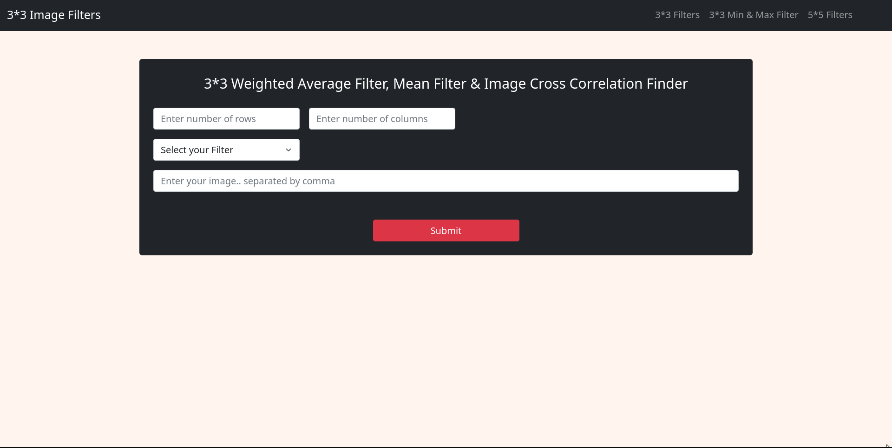
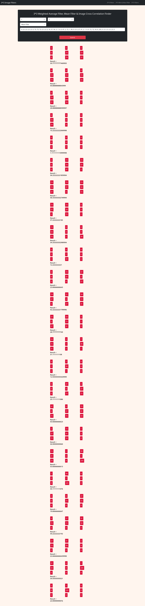
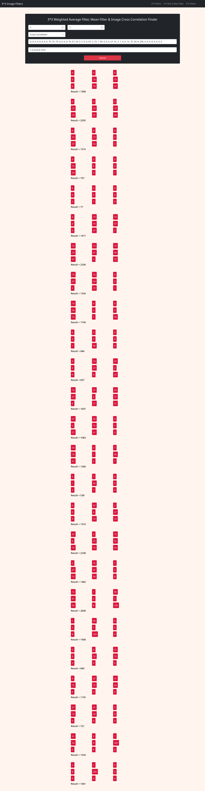

# Image Processing Filters

## Why I made this Web Application?
I'm a Computer Engineering student at Southeast University. I have Image Processing Subject this semester. There are some maths about image filtering which are really time consuming. Then I decided to write the codes which make me simple to find the answer of the questions. I used this during my online exam. Dude It saved my lots of time during exam :p 

## Features of this web application.
* Run 3*3 Mean Filter over the image
* Run 3*3 Min Filter over the image
* Run 3*3 Max Filter over the image
* Run 3*3 Average Weighted over the image
* Run 3*3 Cross Correlation over the image
* Run 5*5 Mean Filter over the image
* Run 5*5 Cross Correlation over the image
* Notice navbar to get other things

## How to use? 
* Enter number of rows & columns
* Select which filter you want to apply.
* Enter your image separated by comma.
* Enter filter for cross correlation.
* Click on submit to get result.

# An example of 3*3 average weighted filter:
* Here number of rows = 7, number of columns = 7
* filter selected -> average weighted filter
* input image: 0, 0, 0, 0, 0, 0, 0, 0, 73, 73, 73, 0, 0, 0, 0, 74, 57, 54, 3, 7, 0, 0, 47, 2, 72, 1, 99, 0, 0, 6, 27, 41, 2, 1, 0, 0, 72, 72, 54, 8, 205, 0, 0, 0, 0, 0, 0, 0, 0
## 3*3 average weighted average filter finder ui

## 3*3 average weighted filter result
;

# 3*3 Mean filter finder

# 3*3 Cross Correlation Finder

Similarly Use 5*5 Filters & 3*3 min and max filter linked in the navbar.
Thank you.....

# Tags
## 3*3 Weighted Average Filter Finder Online
## 3*3 Mean Filter Finder Online
## 3*3 Cross Correlation Finder Online
## 3*3 Min Filter Finder Online
## 3*3 Max Filter Finder Online
## 5*5 Weighted Average Filter Finder Online
## 5*5 Mean  Filter Finder Online
## 5*5 Cross Correlation  Finder Online
